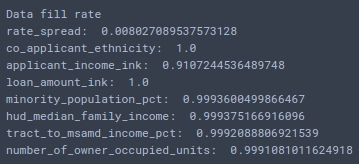

## Загрузка подготовленного датасета
```{r dataset load}
dataset <- read.csv2('const_dataset.csv', sep=',')
dataset <- subset(dataset, minority_population_pct!=0)
dataset <- subset(dataset, tract_to_msamd_income_pct!=0)
```

## Статистика отношения заполненных/незаполненных данных, полученная в процессе чистки на ЯП Python (Notebook приложен)


## Определение факторов датафрейма
```{r defining factors}
dataset$loan_type = factor(dataset$loan_type)
dataset$loan_purpose = factor(dataset$loan_purpose)
dataset$preapproval = factor(dataset$preapproval)
dataset$action_type = factor(dataset$action_type)
dataset$county_name=factor(dataset$county_name)
dataset$lien_status = factor(dataset$lien_status)
dataset$applicant_ethnicity = factor(dataset$applicant_ethnicity)
dataset$applicant_race_1 = factor(dataset$applicant_race_1)
dataset$applicant_sex = factor(dataset$applicant_sex)
dataset$state_name = factor(dataset$state_name)
```

## Исследование исходных данных
### Исследование зависимости спреда ставки от состояния заявки
Ипотечные заявки без указанного спреда ставки являются единственным видом заявок, прошедшие рассмотрение и по которым вынесен вердикт отличный от выдачи кредита. Кредиты со спредом, отличным от 0, находятся в исключительно "выданном" состоянии.
```{r action_type vs. rate_spread}
with(dataset, head(table(rate_spread, action_type), n = 15))
```
### Исследование зависимости отношения статуса предварительного одобрения и расы
Отношение принятых/отклоненных заявок:

Раса | Принятых/отклоненных заявок
------------- | -------------
AmerInd.AlaskaNat | 0,025436047
Asian | 0,031472684
Black.AfroAmer | 0,041377027
Hawaiian.PacificIs | 0,037037037
No Info | 0,019053249
Not Applicable | 0,012048193
White | 0,0289

Афроамериканцы чаще получают предварительное одобрение чем другие расы
```{r race vs preapproval}
with(dataset, table(applicant_race_1, preapproval))
```
```{r race vs action_type}
with(dataset, table(applicant_race_1, action_type))
```
```{r}
with(dataset, hist(as.numeric(applicant_income_ink)))
```

